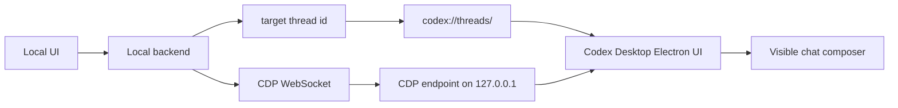

# Architecture

The visible-chat handoff has four pieces:

1. A local tool that prepares the message.
2. A local backend that is allowed to run shell commands.
3. A CDP client connected to the Codex Desktop shell page.
4. Codex Desktop launched with a local CDP port.

Most real apps should add a fifth piece: the target Codex thread id. The id is used to focus the correct Desktop thread first and to keep local artifacts traceable.

The handoff is only the entrypoint. The value is that the message lands inside an environment that can then use project context, files, terminal commands, code execution, browser automation, skills, approvals, automations, and Computer Use-style UI control when available.

This architecture is unstable and experimental. It is appropriate for local prototypes and personal workflows, not production apps.



## Why A Backend Is Needed

The browser frontend should not spawn local processes. A small local server can:

- validate the request,
- save raw local artifacts,
- build a bounded prompt,
- call the Codex Desktop CDP endpoint,
- return structured success or error information.

## Why CDP Works

Codex Desktop is an Electron app. Electron apps can expose a Chrome DevTools Protocol endpoint when launched with `--remote-debugging-port`.

The app backend can use that endpoint to inspect and operate the visible Codex shell. The generated app should connect to the shell target:

1. Fetch `http://127.0.0.1:9222/json/list`.
2. Choose the target where `type === "page"` and `url.startsWith("app://")`.
3. Connect to `webSocketDebuggerUrl`.
4. Use `Runtime.evaluate` to focus the visible bottom Codex composer.
5. Use `Input.insertText` and `Input.dispatchKeyEvent` to insert and submit.

OpenCLI is still useful for smoke tests, but generated apps should not use `opencli codex send` as the app's primary send mechanism. If the in-app browser textarea has focus, a generic adapter can paste into the local app instead of the Codex composer.

Because the target is the visible composer, focusing the correct thread is part of the architecture. If your app knows the desired thread id, open the thread first:

```sh
open "codex://threads/<thread-id>"
```

## What This Does Not Do

This architecture does not:

- patch Codex Desktop,
- bypass login,
- write to Codex session files directly,
- guarantee a new conversation appears in the sidebar instantly,
- provide a stable API contract.

It is UI automation. Treat it accordingly.

## Recommended Boundaries

Use this for local, human-in-the-loop workflows:

- game companions,
- creative tools,
- local control panels,
- note-taking utilities,
- command palettes,
- local research tools,
- personal knowledge-base workflows.

Avoid using it for:

- unattended long-running agents,
- remote multi-user systems,
- CI jobs,
- network-exposed services,
- anything requiring strong delivery guarantees.
